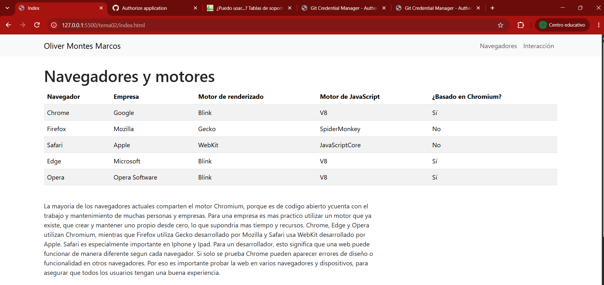
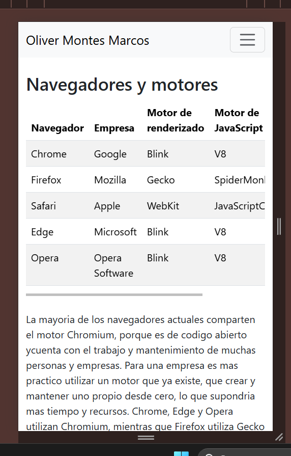
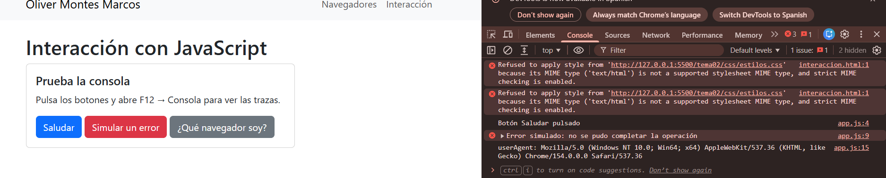
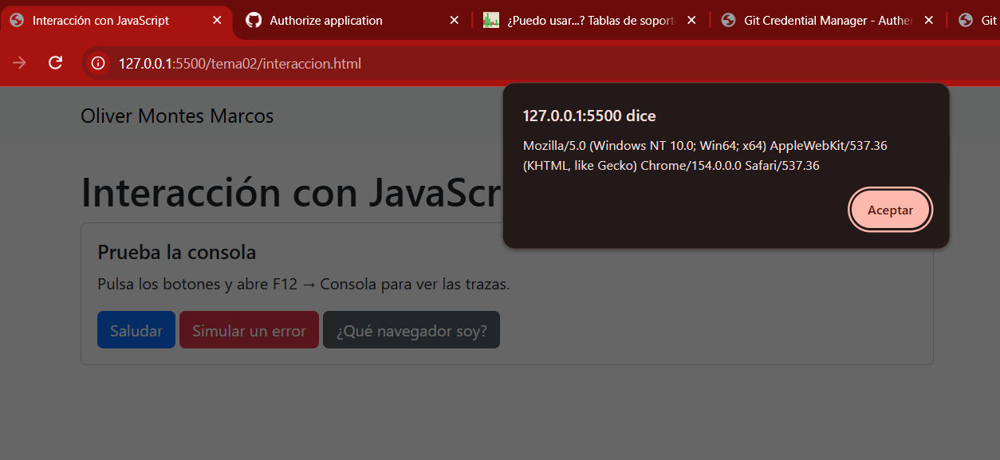
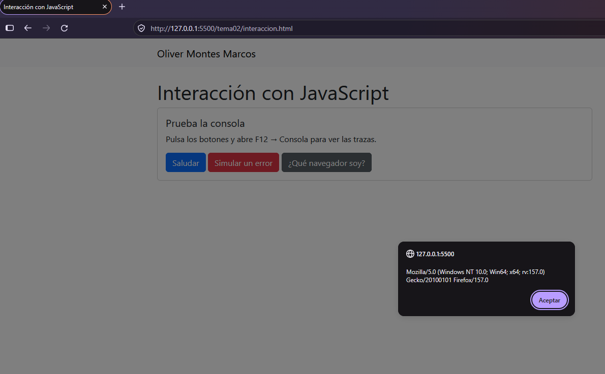
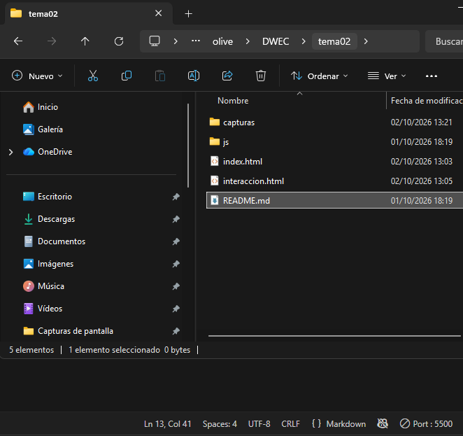

# Tarea 2: Navegadores y primera página interactiva

Oliver Montes Marcos

## Capturas

Pagina index.html en el ordenador con mi nombre en navbar, la tabla navegadores con motores y texto explicativo

Interaccion.html en modo dispositivo simulando un movil. Se adopta todo bien y correctamente. 

Consola del navegador tras pulsar los tres botones. 

Foto de los dos navegadores que se ve que esta funcionando correctamente el navegador que es.

VS code con la carpeta tema2 abierta y LiveServer en marcha.

## Quién hace qué

Botón elegido: **Saludar**.

- **HTML:** define el botón con `<button>` y su atributo `onclick="saludar()"`, que indica qué función se ejecuta al pulsarlo.
- **Bootstrap (CSS):** las clases `btn btn-primary` le dan el aspecto (color azul, bordes redondeados, padding), y la card, el `container` y la rejilla colocan todo en la página.
- **JavaScript:** la función `saludar()` de `app.js` muestra el `alert()` con mi nombre y escribe una traza con `console.log()`.

## Comparación de userAgent

Chrome: `Mozilla/5.0 (Windows NT 10.0; Win64; x64) AppleWebKit/537.36 (KHTML, like Gecko) Chrome/154.0.0.0 Safari/537.36`
Firefox: `Mozilla/5.0 (Windows NT 10.0; Win64; x64; rv:157.0) Gecko/20100101 Firefox/157.0`

En los dos reconozco el SO (Windows NT 10.0; Win64; x64), nombre y version del navegador y motor (Gecko en Firefox). 
Aunque ninguno es Mozilla todos los navegadores la incluyen por herencia historica: Antes klas webs daban la version completa solo a ciertos navegadores
y el resto empezo a copiar. Por eso Chrome incluye AppleWebKit, KHTML, like Gecko y Safari, aunque el motor sea Blink y firefox Gecko

## Fuentes consultadas

- [Can I use: Anchor positioning transforms](https://caniuse.com/wf-anchor-positioning-transforms)
- [MDN: User-Agent](https://developer.mozilla.org/es/docs/Web/HTTP/Headers/User-Agent)
- [Documentación de Bootstrap](https://getbootstrap.com/docs/5.3/)
