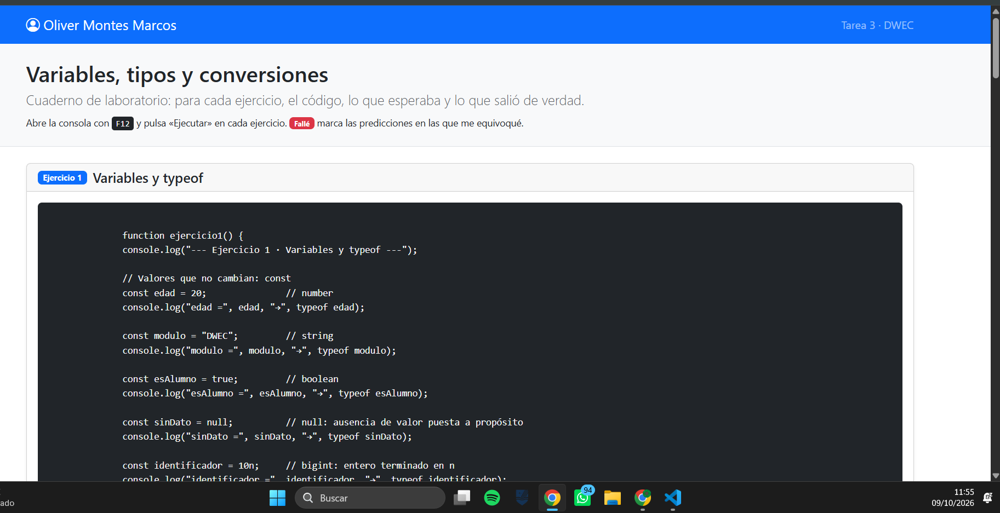
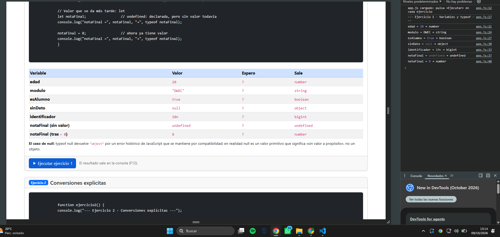
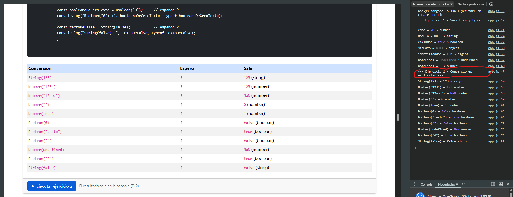
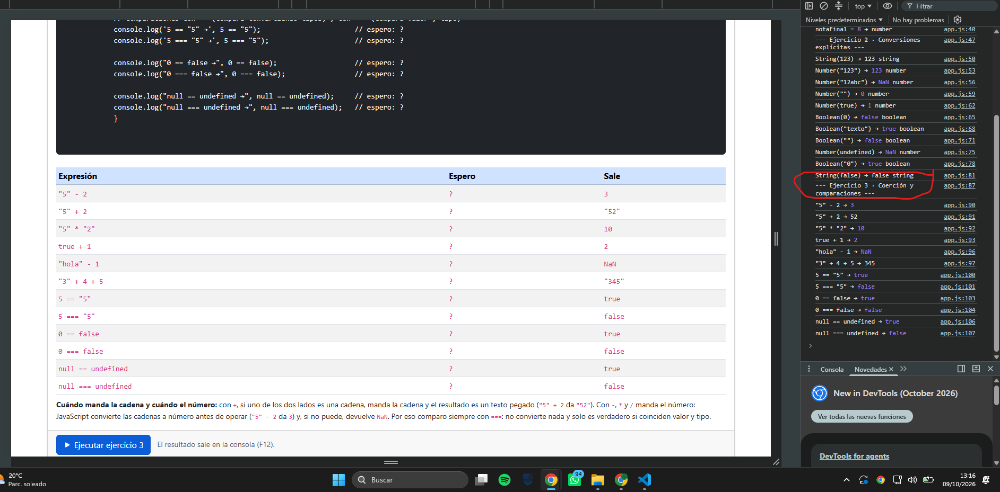
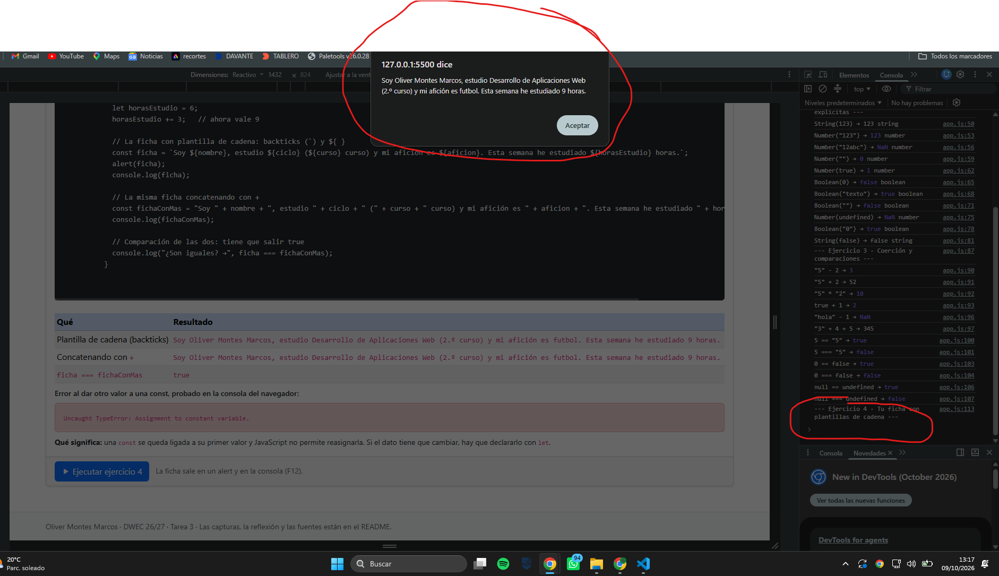

# Tarea 3 · Variables, tipos y conversiones

**Autor:** Oliver Montes Marcos · Desarrollo Web en Entorno Cliente (DWEC) · 2.º DAW · Curso 2026-27

> **Plantilla de la tarea 3.** Cómo usarla:
>
> 1. Copia esta carpeta en tu repositorio de DWEC y cámbiale el nombre a `tema03`.
> 2. `index.html` trae la card del ejercicio 1 como modelo: cópiala para los ejercicios 2, 3 y 4.
> 3. `js/app.js` trae una función por ejercicio: escribe tu código donde pone `TODO`.
> 4. Sustituye las imágenes de `capturas/` por las tuyas, **con el mismo nombre**.
> 5. Todo lo que va entre [corchetes] es un hueco: cámbialo por lo tuyo. Al terminar, borra este aviso.

Esta carpeta contiene una página con Bootstrap que funciona como: cuatro cards (variables y typeof, conversiones, comparaciones, ...), cada una con su código, su tabla «Espero / Sale» y un botón «Ejecutar». Para probarla se abre index.html, se pulsa F12 para ver la consola y se pulsa «Ejecutar» en cada ejercicio.

## Capturas

### a) La página entera

Se ve mi nombre en el navbar, las cuatro cards con sus tablas y los badges <<FALLE>> en las predicciones en las que me equivoque. 

### b) Consola del ejercicio 1

La consola muestra el valor y Typeof de cada variable. sinDato sale como Object aunque vale null y notaFinal pasa de undefined a number

### c) Consola del ejercicio 2

Aparece las onces conversaciones con su resultado y tipo, entre ellas Number("12abc"), que da NaN y Number("") que da 0.

### d) Consola del ejercicio 3

Se ven las seis expresiones que mezclan tipos y las tres parejas comparadas con == y ===

### e) Consola del ejercicio 4, con el error de la const

Se ve la ficha hecha con plantilla de cadena y con +, el true de compararlas con === y debajo TypeError al reasignar una const en la consola

## Reflexión

[De 5 a 8 líneas: ¿qué conversiones te resultaron más intuitivas y cuáles te sorprendieron? Pon ejemplos concretos de tus tablas.]

## Fuentes

- [typeof · MDN Web Docs](https://developer.mozilla.org/es/docs/Web/JavaScript/Reference/Operators/typeof)
- [Igualdad y comparaciones · MDN Web Docs](https://developer.mozilla.org/es/docs/Web/JavaScript/Equality_comparisons_and_sameness)
- [Plantillas de cadena · MDN Web Docs](https://developer.mozilla.org/es/docs/Web/JavaScript/Reference/Template_literals)

## Uso de IA

He utilizado Claude para montar app.jss comprendiendolo y en index las partes de function logs que no las lograba comprender.
